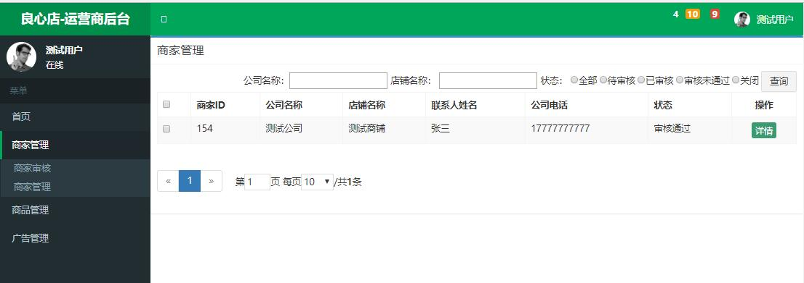

电商系统
项目整体架构基本完成.商品模块和支付等模块未完成,马上就开学了,如果有时间的话我会继续完善各个模块.
注:该项目的前端静态页面使用的是黑马的品优购商城静态页面.(前端写的比较随意,主要注重后端)    
#
### 简介:
* 整个项目基于 Spring Boot 和 Spring Cloud .  
* 使用 Eureka做服务的注册与发现.  
* 使用 Spring Cloud Config 将配置信息存储到远程的Git中, 并且用 Spring Cloud Bus 和 RabbitMQ 消息队列实现动态修改配置文件 .    
* 使用 Spring Cloud Zuul 做网关(我在该网关前又部署了Nginx结合起来使用.非必须).  
* 使用 Spring Cloud Feign 做服务调用,Ribbon做负载均衡.(Feign 对 Ribbon 进行了封装)  
* 使用 Spring Cloud Hystrix 做熔断器,防止级联故障而引起雪崩,且可以做回滚操作,提高系统的整体可靠性.    
* 使用 Apache Solr 做全文搜索,主要用来搜索商品,高亮显示搜索结果.   
* 使用 Spring Cloud Solr 简化Solr搜索的Api调用,使用方法和Spring Data JPA 差不多.  
* 使用 FastDFS 分布式文件系统做文件存储(这玩意儿建议直接装在Docker,因为安装和配置比较麻烦!).    
* 使用 Spring Security 实现权限控制.  
* 使用 Hibernate 做持久层(不选Mybatis的原因是因为暑假没多少时间,用Hibernate开发周期比较短,当然,运行效率也会相对比较低一些)  
* 使用 Spring Data JPA 简化持久层开发.  
* 使用 AngularJS 做前端.Angular2其实是个更好的选择,只不过不想在前端浪费太多时间  
* 使用 Swagger2 生成文档API
未完待续...  
#
### 使用到的框架和技术一览
* Spring Boot
* Spring Cloud Eureka
* Spring Cloud Config
* Spring Cloud Zuul
* Spring Cloud Bus
* Spring Cloud Feign
* Spring Cloud Hystrix
* Spring Data Redis
* Spring Data Solr
* Spring Security
* RabbitMQ
* Swagger2
* Hibernate
* MySQL
* Redis
* Solr
* ZipKin
* Docker
* FastDFS
* AngularJS
* Nginx
#

### 端口说明:  
* GATEWAY-SERVICE         :9000  ----网关,Zuul  
* CLOUD-CENTER            :9010  ----服务注册中心,Eureka  
* CONFIG-CENTER           :9050  ----配置中心,Spring Cloud Config  
* AUTH-CENTER             :9080  ----鉴权中心,Spring Security 结合 JWT  
* USER-SERVICE            :9301  ----用户服务  
* GOODS-SERVICE           :9501  ----商品服务  
* ORDER-SERVICE           :9601  ----订单服务  
* MANAGER-SERVICE         :9701  ----后台管理服务  
* SELLER-SERVICE          :9801  ----商家后台管理服务  
* SEARCH-SERVICE          :9901  ----搜索服务,采用Solr搜索解决方案
* STORAGE-SERVICE         :22000 ----分布式文件存储中心(使用的是FastDFS)  

#

#

#

#

#

#

